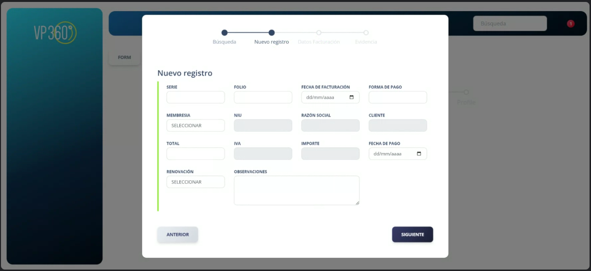

<!-- TOC -->
* [Query 1](#query-1)
* [Vista](#vista)
* [TODO 08-19-2024](#todo-08-19-2024)
* [TODO 08-20-2024](#todo-08-20-2024)
  * [Reordenar columnas:](#reordenar-columnas)
  * [Vista nueva](#vista-nueva)
    * [**Búsqueda**](#búsqueda)
    * [**Nuevo Registro**](#nuevo-registro)
      * [TODO 08-22-2024](#todo-08-22-2024)
    * [**Datos de facturación**](#datos-de-facturación)
    * [**Evidencia**](#evidencia)
      * [TODO 08-29-2024](#todo-08-29-2024)
      * [TODO 09-02-2024](#todo-09-02-2024)
      * [TODO 09-03-2024](#todo-09-03-2024)
<!-- TOC -->

# Query 1

```txt
innerjoin usarios->id_cliente -> clientes_hash->id
innerjoin usarios->id -> facturacion->id_proveedor
innerjoin usarios->id -> niu->id_proveedor

condiciones -> likes
estatus_registro->COMPLETADO

seleccionar
usuarios->rfc
usuarios->name
usuarios->apellido_paterno
usuarios->apellido_materno
usuarios->razon_social
usuarios->tipo_sociedad
usuarios->email
usuarios->tipo_proveedor
clientes_hash_crypt->cliente

likes
usuarios->rfc
usuarios->razon_social
{ SOLA BÚSQUEDA
usuarios->name
usuarios->apellido_paterno
usuarios->apellido_materno
}
niu->niu

```

# Vista

`file:///C:/Anghel/development/vp360/template/pages/applications/datatables.html`

- 

# TODO 08-19-2024

- (Remover)Tipo Proveedor
- (Remover)Status
- Nombre/Razón Social
- Búsqueda por niu(PK)
- cliente -> clientes_hash_crypt -> cliente

# TODO 08-20-2024

## Reordenar columnas:

1. Cliente
2. Nombre
3. RFC

- Modal: file:///C:/Anghel/development/vp360/template/pages/applications/wizard.html
- Pasos:

## Vista nueva

### **Búsqueda**

- **Incluir el niu en la tabla niu y datos facturación tabla facturación.**
- 

### **Nuevo Registro**

- Crear nueva tabla con los campos del form.
- Todos los campos obtenidos de la consulta aparecerán inhabilitados en el formulario.
- Membresía:
  - Anual
  - Mensual
- Renovación:
  - Renovación
  - Nuevo
#### TODO 08-22-2024
- IMPORTE: Bloqueado -> (Total / 1.16) # Validacion en front y back
- IVA: Bloqueado -> (Total - importe) # Validacion en front y back
- Forma de pago: Texto Libre


- 

### **Datos de facturación**

- Mapear datos desde consulta e inhabilitar campos.
- Régimen fiscal:
  - Listado de todos los existentes (excel/correo)
- Dirección:
  - Catálogos por compartir (excel/correo)
- 

### **Evidencia**

- SI -> Adjuntar archivo
- No -> No adjuntar nada
- Directorio para almacenar soporte documental.
- Guardar -> almacenar en tabla: facturación_test(por revisar)
- Archivo PDF (guardar referencia en DB)
- Al guardar redirigir `/admin/proveedores` con alerta (sweetAlert *Opcional)
- 

#### TODO 08-29-2024

- Al término del proceso de guardar información que el modal no aparezca y no muestre ninguna consulta.
- Datos facturación debera traer los datos del formulario ya llenados.
- En evidencia en caso de no guardar archivo guarde "pendiente"
- En la pagina principal mostrar los registros guardados con el orden:
    - Serie
    - Folio
    - Fecha Fact.
    - Forma de pago
    - Membresía
    - NIU
    - Razón Social
    - Cliente
    - Total
    - IVA
    - Importe
    - Fecha Pago
    - Observaciones

#### TODO 09-02-2024

- En la tabla principal agrega una columna de archivos
  - En caso de que este pendiente mostrar un botón para agregar el archivo
  - En caso de que tenga archivo agregar un botón para descargar el archivo
  - Separar la paginación del scroll
  - Agregar una separación entre botones

#### TODO 09-03-2024
- Columna nueva al principio "Acción"
  - Descargar PDF
    - Botón descarga:
    - 
    - `file:///C:/Anghel/development/vp360/template/pages/pages/account/settings.html`
  - Ver Info
    - Modal solo lectura de "Nuevo Registro" & "Datos Facturación"
- Actualizar la tabla a "Datatable Search" `file:///C:/Anghel/development/vp360/template/pages/applications/datatables.html`
